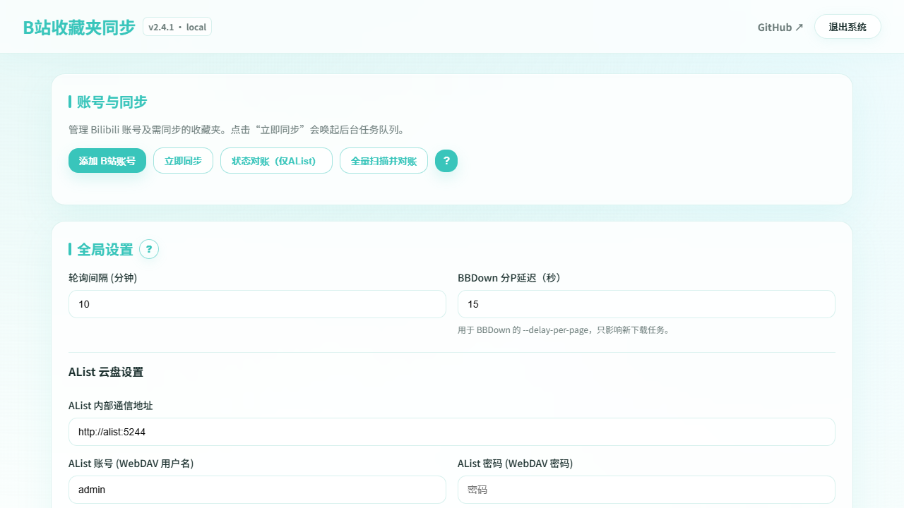

# Bili-favorites-backup

> 把B站收藏夹持续归档到AList云盘，并确认远端文件真的存在。

[完整文档](https://minori0721.github.io/Bili-favorites-backup/) · [5分钟部署](https://minori0721.github.io/Bili-favorites-backup/guide/docker) · [问题排查](https://minori0721.github.io/Bili-favorites-backup/troubleshooting/docker-hub) · [版本记录](CHANGELOG.md)



BFB是一个面向云盘归档的B站收藏夹持续备份系统：定时扫描多个账号的收藏夹，使用固定版本BBDown与aria2下载，通过AList WebDAV上传到国内网盘，并在远端文件同名同大小可见后才确认备份完成。

## 核心能力

- **云盘归档**：支持多B站账号、多收藏夹和多个AList目标，按关系分别保存远端备份证明。
- **持久恢复**：SQLite任务队列、任务租约、aria2控制文件和分P CID会话共同支持容器重启恢复。
- **可靠上传**：PUT成功后进入“已上传·确认中”，远端最终确认前保留本地成品；同名异大小旧版归档到`_history`。
- **风险控制**：Web/APP播放接口可选，B站`v_voucher`触发固定3分钟冷却与单任务探测，AList异常会暂停新下载。
- **长期维护**：充电视频七日权限复查、下架与部分备份、分P历史归档、画质共享下载、迁移包和远端对账。

## Docker部署

新建`docker-compose.yml`：

```yaml
services:
  app:
    image: minori0721/bili-favorites-backup:latest
    container_name: bili-favorites-backup
    restart: unless-stopped
    ports:
      - "3000:3000"
    environment:
      - ADMIN_USER=${ADMIN_USER:-admin}
      - ADMIN_PASS=${ADMIN_PASS:-please-change-admin-pass}
      - SESSION_SECRET=${SESSION_SECRET:-please-change-session-secret}
      - ALLOW_COOKIE_EXPORT=${ALLOW_COOKIE_EXPORT:-false}
    volumes:
      - ./data:/app/data
      - ./temp:/app/temp
      - ./alist:/app/alist:ro
    depends_on:
      - alist

  alist:
    image: xhofe/alist:v3.61.0
    container_name: bili-favorites-backup-alist
    restart: unless-stopped
    ports:
      - "5244:5244"
    environment:
      - PUID=0
      - PGID=0
      - UMASK=022
      - ALIST_ADMIN_PASSWORD=${ALIST_ADMIN_PASSWORD:-please-change-alist-pass}
    volumes:
      - ./alist:/opt/alist/data
```

在同目录创建`.env`并修改密码：

```dotenv
ADMIN_PASS=换成独立强密码
SESSION_SECRET=换成足够长的随机字符串
ALIST_ADMIN_PASSWORD=换成另一个强密码
```

启动：

```bash
docker compose pull
docker compose up -d
```

- BFB面板：`http://localhost:3000`
- 内置AList：`http://localhost:5244`

已有AList时可只部署`app`服务，并在BFB设置中填写AList可达地址、WebDAV账号和目标目录。详细步骤见[连接AList](https://minori0721.github.io/Bili-favorites-backup/alist/overview)。

## 数据与升级

必须持久化`data:/app/data`和`temp:/app/temp`。前者保存SQLite、配置与账号，后者保存下载会话、aria2断点和待补传成品；使用内置AList时还必须持久化`alist:/opt/alist/data`。

```bash
docker compose pull
docker compose up -d
docker compose logs --tail=100 app
```

拉取镜像失败时，旧容器仍可能显示运行，但并不代表更新成功。升级、迁移和回滚前请阅读[日常维护文档](https://minori0721.github.io/Bili-favorites-backup/operations/update)。

## 安全提示

- 立即修改`ADMIN_PASS`、`SESSION_SECRET`和AList管理员密码。
- 不需要网页导出B站Cookie时保持`ALLOW_COOKIE_EXPORT=false`。
- 仅在HTTPS反向代理下设置`COOKIE_SECURE=true`；纯HTTP开启后浏览器不会发送会话Cookie。
- 迁移包和`data/users.json`可能包含B站Cookie或APP token，不能公开分享。
- 原始日志虽经过脱敏，仍可能包含BVID、文件名与路径，公开前请人工复核。

## 镜像与开发

- `minori0721/bili-favorites-backup:latest`：`main`稳定版。
- `minori0721/bili-favorites-backup:dev`：`dev`测试版。
- `v*.*.*`标签发布对应版本镜像。
- 当前只发布`linux/amd64`，源码运行要求Node.js 24。

```bash
npm ci
npm test
npm run build
```

项目当前使用固定BBDown fork Release、固定FFmpeg构建和aria2续传，不在构建时跟随上游`master`。

## 鸣谢

- [BBDown](https://github.com/nilaoda/BBDown)
- [AList](https://alist.nn.ci/)
- [biliAPI](https://github.com/renmu123/biliAPI)
- [FFmpeg](https://ffmpeg.org/)
- [Bilibili API Collect](https://socialsisteryi.github.io/bilibili-API-collect/)
