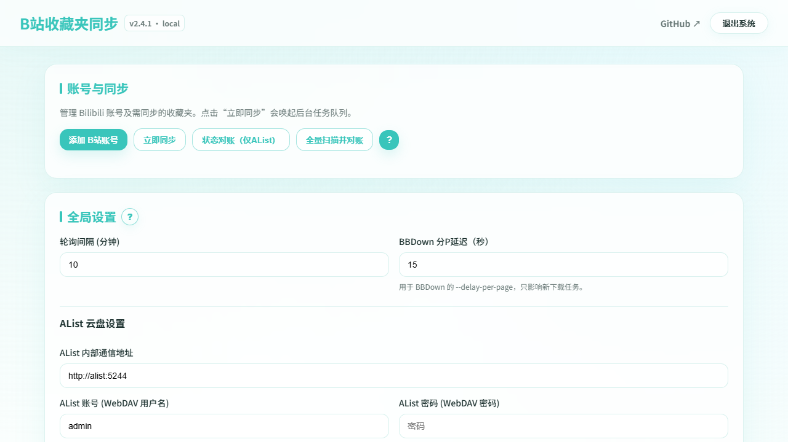

# Bili-favorites-backup

> 把B站收藏夹持续归档到AList云盘，并确认远端文件真的存在。

[完整文档](https://minori0721.github.io/Bili-favorites-backup/) · [5分钟部署](https://minori0721.github.io/Bili-favorites-backup/guide/docker) · [问题排查](https://minori0721.github.io/Bili-favorites-backup/troubleshooting/docker-hub) · [版本记录](CHANGELOG.md)



BFB是一个面向云盘归档的B站收藏夹持续备份系统：定时扫描多个账号的收藏夹，使用固定版本BBDown与aria2下载，通过AList WebDAV上传到国内网盘，并在远端文件同名同大小可见后才确认备份完成。

## 核心能力

- **云盘归档**：支持多B站账号、多收藏夹和多个AList目标，按关系分别保存远端备份证明。
- **持久恢复**：SQLite任务队列、任务租约、aria2控制文件和分P CID会话共同支持容器重启恢复。
- **可靠上传**：PUT成功后进入“已上传·确认中”，远端最终确认前保留本地成品；同名异大小旧版归档到`_history`。
- **本地归档库**：从账号与同步区域打开全屏媒体库，按全部账号、单账号、当前收藏夹、已停用收藏夹或已移除账号浏览SQLite索引；支持状态筛选、标题排序、跨账号搜索、连续播放和按来源安全清理归档，浏览过程不请求B站或扫描AList目录。
- **归档播放**：在收藏夹详情中直接播放远端已验证的MP4、M4V和WebM；优先使用网盘临时直链并自动回退BFB代理，显示本次真实传输方式和实际媒体画质，并可跳转到对应AList文件。
- **风险控制**：Web/APP播放接口可选，B站`v_voucher`触发固定3分钟冷却与单任务探测，AList异常会暂停新下载。
- **长期维护**：充电视频七日权限复查、下架与部分备份、分P历史归档、画质共享下载、迁移包和远端对账。

## Docker部署

新建`docker-compose.yml`：

```yaml
services:
  app:
    image: minori0721/bili-favorites-backup:latest
    container_name: bili-favorites-backup
    restart: unless-stopped
    ports:
      - "3000:3000"
    environment:
      - ADMIN_USER=${ADMIN_USER:-admin}
      - ADMIN_PASS=${ADMIN_PASS:-please-change-admin-pass}
      - SESSION_SECRET=${SESSION_SECRET:-please-change-session-secret}
      - ALLOW_COOKIE_EXPORT=${ALLOW_COOKIE_EXPORT:-false}
    volumes:
      - ./data:/app/data
      - ./temp:/app/temp
      - ./alist:/app/alist:ro
    depends_on:
      - alist

  alist:
    image: xhofe/alist:v3.61.0
    container_name: bili-favorites-backup-alist
    restart: unless-stopped
    ports:
      - "5244:5244"
    environment:
      - PUID=0
      - PGID=0
      - UMASK=022
      - ALIST_ADMIN_PASSWORD=${ALIST_ADMIN_PASSWORD:-please-change-alist-pass}
    volumes:
      - ./alist:/opt/alist/data
```

在同目录创建`.env`并修改密码：

```dotenv
ADMIN_PASS=换成独立强密码
SESSION_SECRET=换成足够长的随机字符串
ALIST_ADMIN_PASSWORD=换成另一个强密码
```

启动：

```bash
docker compose pull
docker compose up -d
```

- BFB面板：`http://localhost:3000`
- 内置AList：`http://localhost:5244`

已有AList时可只部署`app`服务，并在BFB设置中填写AList可达地址、WebDAV账号和目标目录。详细步骤见[连接AList](https://minori0721.github.io/Bili-favorites-backup/alist/overview)。

## 数据与升级

必须持久化`data:/app/data`和`temp:/app/temp`。前者保存SQLite、配置与账号，后者保存下载会话、aria2断点和待补传成品；使用内置AList时还必须持久化`alist:/opt/alist/data`。

`v2.4.6`使用SQLite `user_version 7`；`v2.4.5`使用schema 6。schema 1至6首次升级到schema 7前会在`data/backups`生成一致性数据库备份和SHA256摘要；旧镜像不能直接打开schema 7数据库，回滚时应恢复该备份。JSON兼容状态仍为schema 13，迁移包仍为schema 3。

从`v2.4.3`及更早版本直接更新到`v2.4.6`后需要重新登录一次；之后可在登录页选择固定保持30天。从`v2.4.4`或`v2.4.5`更新不会因本次升级主动撤销现有管理员会话。

已有远端归档时，设置页不能直接改`alistDest`。请使用“迁移归档路径”：它只支持同一AList挂载存储，先扫描预览，再用WebDAV COPY复制并确认整个旧目录，最后切换配置。新旧目录不会混用，旧目录默认保留，确认无误后还需手动输入`DELETE OLD ARCHIVE`才能清理。

```bash
docker compose pull
docker compose up -d
docker compose logs --tail=100 app
```

拉取镜像失败时，旧容器仍可能显示运行，但并不代表更新成功。升级、迁移和回滚前请阅读[日常维护文档](https://minori0721.github.io/Bili-favorites-backup/operations/update)。

## 安全提示

- 立即修改`ADMIN_PASS`、`SESSION_SECRET`和AList管理员密码。
- 不需要网页导出B站Cookie时保持`ALLOW_COOKIE_EXPORT=false`。
- 仅在HTTPS反向代理下设置`COOKIE_SECURE=true`；纯HTTP开启后浏览器不会发送会话Cookie。
- 管理员会话保存在`data/auth-sessions.sqlite`：普通登录使用浏览器会话Cookie且服务端最长保留24小时，登录页可主动选择固定保持30天；修改管理员账号、密码或`SESSION_SECRET`会使旧会话失效。
- 迁移包和`data/users.json`可能包含B站Cookie或APP token，不能公开分享。
- 迁移包不会包含管理员会话库；手工备份整个`data/`仍应按敏感数据保管。
- 原始日志虽经过脱敏，仍可能包含BVID、文件名与路径，公开前请人工复核。

## 镜像与开发

- `minori0721/bili-favorites-backup:latest`：`main`稳定版。
- `minori0721/bili-favorites-backup:dev`：`dev`测试版。
- `v*.*.*`标签发布对应版本镜像。
- 当前只发布`linux/amd64`，源码运行要求Node.js 24。

```bash
npm ci
npm test
npm run build
```

项目当前使用固定BBDown fork Release、固定FFmpeg构建和aria2续传，不在构建时跟随上游`master`。

`v2.4.6`固定BBDown fork Release `bfb-2.0.1`：普通UGC改用PlayerUnite并合并AVC、HEVC和AV1流；APP结果仅480P或低于明确请求档位时，只在WEB视频档位确实更高时合并WEB视频，APP取得的普通、杜比和Hi-Res音频继续保留。每个账号使用独立、稳定且不进入WEB Cookie的APP设备标识。`v2.4.5`镜像继续固定`bfb-2.0.0`。

“全量扫描并对账”右侧的“归档库”只读取当前`data/bfb.sqlite`和账号配置。全局与账号目录会按BV号合并重复关系，具体收藏夹保留当前收藏顺序和历史关系；每批读取50项，搜索覆盖归档前标题、UP主和BV号。可播放卡片进入现有播放器，并按当前目录、筛选、排序和基础搜索形成连续队列；同一BV有多份已验证成品时优先选择实际媒体参数更高且更完整的来源。不可播放卡片只展示本地保存的来源与脱敏状态，不会为了补信息临时访问B站。

删除账号默认只移除登录信息，远端文件、SQLite证明、封面和播放能力都会保留，并在归档库的“已移除账号”目录继续可见；同一UID重新登录会恢复关联。危险选项“删除账号并清理远端归档”需要先预览并输入`DELETE REMOTE ARCHIVE`。归档库也可以在来源详情中删除历史关系、停用收藏夹或已移除账号的单个来源；当前仍同步的关系禁止删除。

远端清理只处理SQLite已追踪、位于当前`alistDest`边界内且经HEAD重新确认类型和大小一致的文件。共享物理路径仍被其他来源引用时只解除目标证明；BFB永不对远端目录发送集合`DELETE`，因此未知文件不会被目录删除连带移除，清理后可能留下空目录供用户在AList中人工确认。任务开始后不可取消，重启会从最后确认项继续；失败后可直接重试，AList连接、路径或本地证明变化时应重新预览并再次确认。“已删除”筛选保留最小审计记录，普通列表、搜索和播放队列不会包含已删除来源。

归档播放器先由BFB校验登录和文件归属；AList提供合格的外部HTTPS临时直链时使用302让浏览器直连网盘，否则自动回退BFB流式代理。播放器会显示本次实际采用的传输方式。新下载会保存BBDown实际选中的B站档位，宽高、帧率和编码则来自ffprobe，例如`P1 · B站4K · 实际1772p · 1772×3840 竖屏 · HEVC · 网盘直连`。实际画质按真实短边显示，不会把`1772×3840`向下归入1440p或1080p；旧归档没有可靠的B站档位时直接省略该段，不根据尺寸猜测。

如需“在 AList 中查看”，请在设置中单独填写AList网页访问地址；它与容器内部WebDAV通信地址分离，支持反向代理基础路径。直连能减少BFB服务器流量，但临时签名地址会在浏览器网络面板中可见。播放器不执行转码：网络错误最多自动切换BFB代理一次，解码错误不会切代理；实际或高度疑似HEVC且浏览器不支持时会直接给出兼容性提示。

## 鸣谢

- [BBDown](https://github.com/nilaoda/BBDown)
- [AList](https://alist.nn.ci/)
- [Artplayer](https://artplayer.org/)
- [biliAPI](https://github.com/renmu123/biliAPI)
- [FFmpeg](https://ffmpeg.org/)
- [Bilibili API Collect](https://socialsisteryi.github.io/bilibili-API-collect/)
